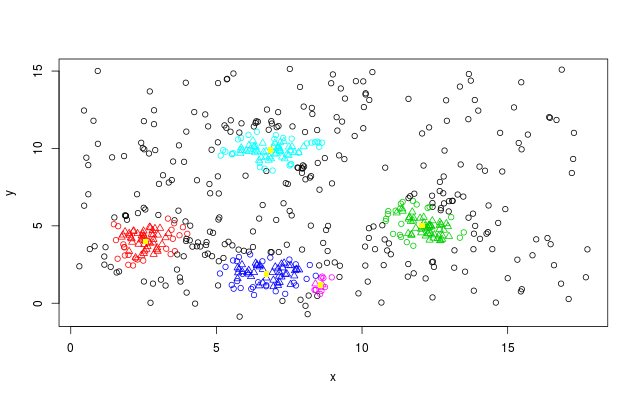

K-means clusters and centroids detection
========================================================
author: Borzam
date: 21.07.2014

What this script does
========================================================

- Generates a set of random points

   + larger density around some areas (gaussian 2D)
   
   + background noise (uniform)
   

- Groups points into clusters

   + uses the *dbscan()* function

   + density based clustering
   
   + each group has a different colour
   
   + centroids

Controls
========================================================

- Inputs

   + Seed: for set.seed()
   
   + Standard deviation of the gaussian 2D distribution
   
   + Noise level: the number of noise points added
   
   + Epsilon: the reachability threshold used to group points
   
   + Minimum points per cluster

- Output graph

   + Black dots: starting random points
   
   + Colored dots: points assigned to a specific cluster
   
   + Yellow square dots: computed centroids of clusters
   
The code in server.R
========================================================


```r
library(UsingR)
library(fpc)
shinyServer(
    function(input, output) {
		seed       <- reactive({input$seed})
        sigma      <- reactive({input$sigma})
		noiselevel <- reactive({input$noiselevel})
		epsilon    <- reactive({input$epsilon})
		minpoints  <- reactive({input$minpoints})
		output$clustPlot <- renderPlot({
			set.seed(seed())
			locs <- c(3,4,12,5,7,2,7,10)
			x <- c()
			y <- c()
			for (i in seq(1,length(locs)/2)) {
			    mx <- locs[(i-1)*2+1]
			    my <- locs[(i-1)*2+2]
				xy.sd <- sigma()
			    x <- c(x,rnorm(100,mx,xy.sd))
			    y <- c(y,rnorm(100,my,xy.sd))
			}
			maxx <- max(x)* 1.2
			maxy <- max(y)* 1.2
			noise.level <- noiselevel()
			x <- c(x,runif(noise.level,0,maxx))
			y <- c(y,runif(noise.level,0,maxy))
			plot(x,y,xlim=c(0,maxx),ylim=c(0,maxy))
			df <- cbind(x,y)
			ds <- dbscan(df, eps=epsilon(), MinPts=minpoints(),showplot = 2)
			cx <- c()
			cy <- c()
			for (i in seq(1,max(ds$cluster))) {
			    cx <- c(cx,mean(x[ds$cluster==i]))
			    cy <- c(cy,mean(y[ds$cluster==i]))
			}
			points(cx,cy,pch=15,col="yellow",bg="yellow",xlim=c(0,maxx),ylim=c(0,maxy))
        })
	}
)
```

Numerical results and plot
========================================================


```r
## check the .Rpres file to view the full code
df <- cbind(x,y)
ds <- dbscan(df, eps=0.7, MinPts=15,showplot = 0)
print(ds)
```

```
dbscan Pts=600 MinPts=15 eps=0.7
         0  1  2  3  4  5
border 296 24 21 28 29 11
seed     0 47 51 44 47  2
total  296 71 72 72 76 13
```


